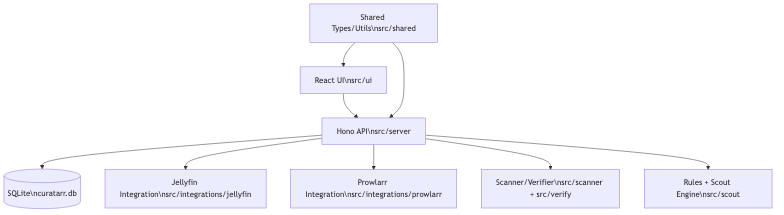
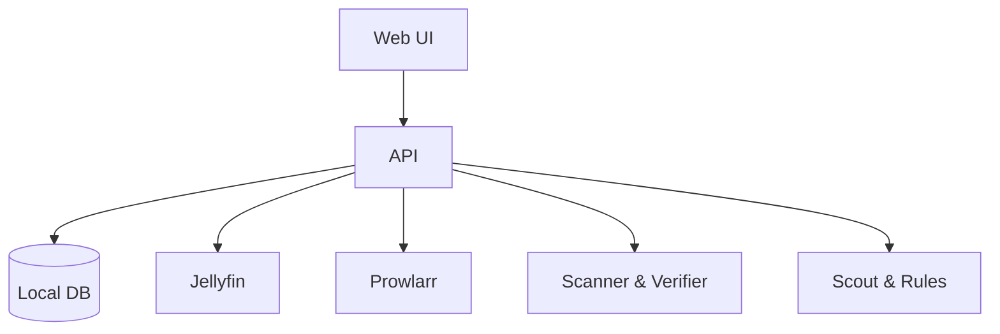

# Curatarr Architecture



## System Diagram


To regenerate the PNG from the Mermaid source:
```
npx -y @mermaid-js/mermaid-cli -i packages/curatarr/docs/technical/architecture.mmd -o packages/curatarr/docs/technical/architecture.png
```

## Frontend Placement
- UI route-entry pages live in `src/ui/src/pages`.
- Reusable UI/feature modules live in `src/ui/src/components`.
- Shared UI primitives (icons, overlays, shared feature blocks) live in `src/ui/src/components/shared`.
- Typed UI API access uses `src/ui/src/api/client.ts` and shared contracts from `src/shared/types/api.ts`.

## Repository Layering
- `src/server`: API surface, route composition, schedulers, and app startup wiring.
- `src/ui`: frontend app, feature components, and Vite build.
- `src/integrations`: external-service adapters used by server routes/jobs.
- `src/shared`: cross-layer runtime utilities and type contracts.

Related docs: [frontend.md](./frontend.md), [repo.md](./repo.md)

Mermaid source file: `architecture.mmd`.
